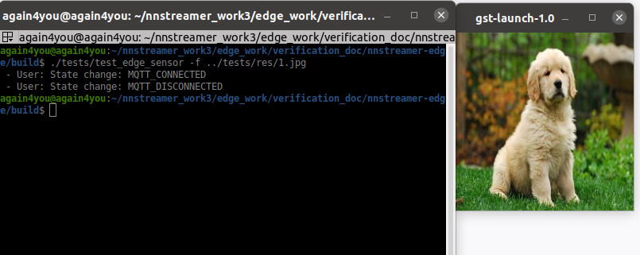
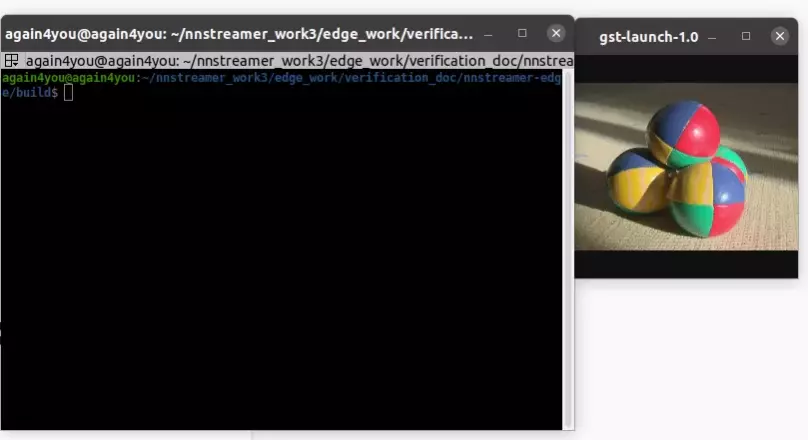

# nnstreamer-edge-sensor

`nnstreamer-edge-sensor` is a utility library for publishing any type of data as an MQTT message.
Without GStreamer dependencies, it can provide remote nodes with stream input data such as camera image, temperature, or humidity.
`mqttsrc` element of NNStreaer can access these data and exploit them on pipeline stream.

`nnstreamer-edge-sensor` is designed not to depend on GStreamer/GLib so targets to be adopted by general RTOS or Lightweight devices.


## Getting Started

### Prerequisites

To build `nnstreamer-edge-sensor` in the Ubuntu/Debian envrionment, the following packages are needed.

```bash
$ sudo apt install cmake libpaho-mqtt-dev libpaho-mqtt1.3 mosquitto mosquitto-clients
```

### How to build

When building `nnstreamer-edge-sensor`, you can set the soversion of nnstreamer-edge-sensor or enable test program. 
In this example, the test program is enabled for a future test. (`-DENABLE_TEST=ON`)

```bash
$ git clone https://github.com/nnstreamer/nnstreamer-edge.git
$ cd nnstreamer-edge
$ mkdir build
$ cd build
...
# In this example, test is enabled.
$ cmake .. -DCMAKE_INSTALL_PREFIX=/usr -DENABLE_TEST=ON
$ make
```

Note that, to install the built library, you need the `root` permission. You can make an rpm or debian package and install it.


## How to use

## Test Result

### Check the mqttsrc and mqttsink are available

```bash
$ gst-inspect-1.0 --gst-plugin-path="build" | grep mqtt
mqtt:  mqttsink: MQTT sink
mqtt:  mqttsrc: MQTT source
```

If `mqtt` emelemt is not available, then build the NNStreaemr from the source code.

```bash
$ git clone https://github.com/nnstreamer/nnstreamer.git
$ cd nnstreamer

# Enable the mqtt-support option as below
# meson_options.txt
# +option('mqtt-support', type: 'feature', value: 'enabled')

$ meson build
$ ninja -C build
```

### Server side
```bash
$ GST_DEBUG=mqttsrc:5 gst-launch-1.0 --gst-plugin-path="build" mqttsrc debug=1 sub-topic=TestTopic host=localhost sub-timeout=9223372036854775807 ! jpegdec ! video/x-raw,framerate=0/1 ! videoscale ! videoconvert ! ximagesink qos=0
```

### Publish single data
```bash
./tests/test_edge_sensor -f ../tests/res/1.jpg
```


### Publish multiple data

